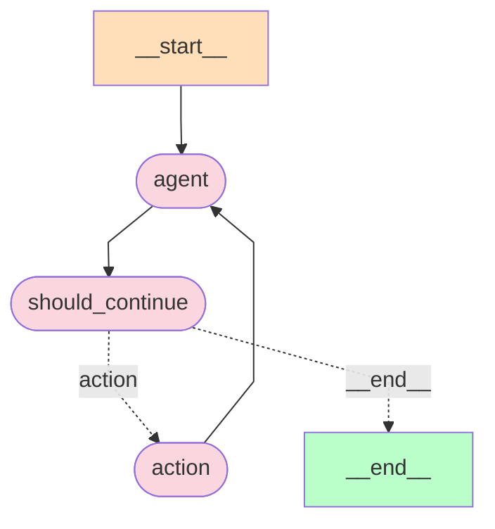

## LangGraph

```mermaid
%%{init: {'flowchart': {'curve': 'linear'}}}%%
graph TD;
        __start__[__start__]:::startclass;
        __end__[__end__]:::endclass;
        agent([agent]):::otherclass;
        action([action]):::otherclass;
        should_continue([should_continue]):::otherclass;
        __start__ --> agent;
        action --> agent;
        agent --> should_continue;
        should_continue -. action .-> action;
        should_continue -. __end__ .-> __end__;
        classDef startclass fill:#ffdfba;
        classDef endclass fill:#baffc9;
        classDef otherclass fill:#fad7de;
```
